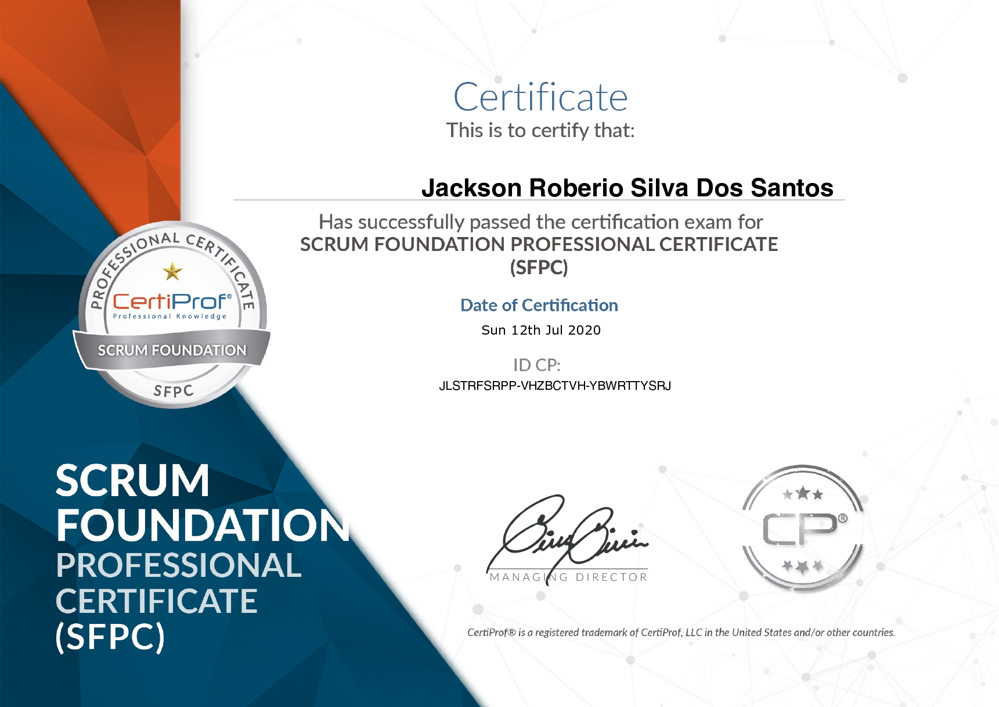
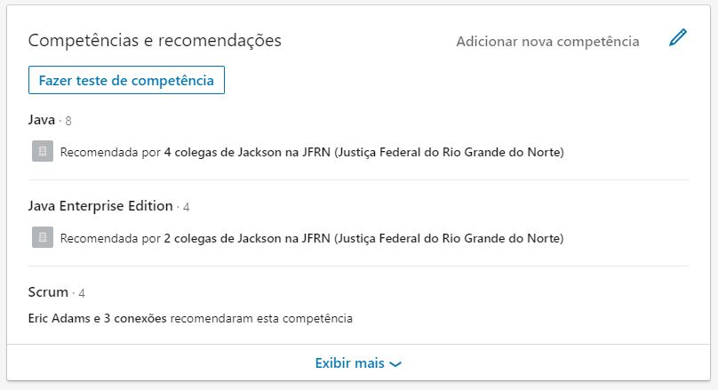
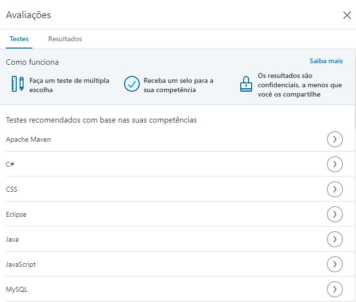
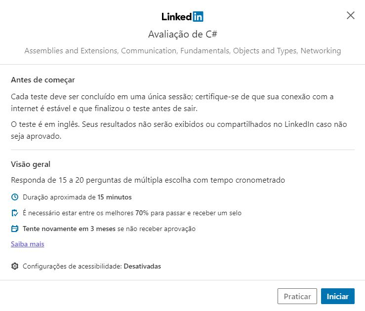

<h1 align="center"> :scroll: Manual Para Certificação Ágile & Scrum  </h1> 

Este documento tem por objetivo instruir os usuários do Scrum a se especializar no framework e obter certificação no Scrum. 

# Sobre Autor :bowtie:

**Nome** : Jackson Roberio S. dos Santos

:mortar_board: Formado em Sistemas da Informação pela Universidade Potiguar (UNP) e Pós-graduado em Dispositivos Móveis pela UNP.

:briefcase: Supervisor Assistente do Núcleo de Tecnologia da Informação e Comunicação na Justiça Federal no Rio Grande do Norte.

Trabalho com metodologias ágeis em projetos de softwares desde 2016.

**Certificações**

	- Scrum Foundation Professional Certificate (CertiProf)
	
[@Github](https://github.com/jackson-roberio)

[@Linkedin](https://www.linkedin.com/in/jackson-roberio/)

[@StackOverFlow](https://pt.stackoverflow.com/users/161243/jackson-roberio)

# Gerenciamento Ágil de Projetos :football:

## Sobre o Scrum :book:

Quando fazemos menção ao Scrum, é comum o associarmos aos métodos ágeis, processo utilizado mundialmente! O conceito, entretanto, é mais antigo do que o traduzo por seus fundadores: *Ken Schwaber* e *Jeff Sutherland*.

*Ken* e *Jeff* se basearam em um artigo criado por *Takeuchi* e *Nonaka* que foi publico em 1986 pela revista *Havard Business Review*, com o nome de **The New New Product Development Game** o termo "**Scrum**" foi criado por  em alusão à formação do Rugby, em que todo o time está junto buscando a posse da bola. Se alguém quebra a formação, todo o time perde. Da mesma forma, quando alguém consegue a posse da bola, o time inteiro é responsável, ou seja, os indivíduos são menos importantes do que o time como um todo, se um individual erra, todo o time errou, se o time ganha, então todos os indivíduos foram responsáveis por essa conquista.

Portanto, o Scrum é um framework para desenvolver, entregar e manter produtos complexos. Uma ferramenta fácil de entender, porém difícil de dominar (segundo o próprio guia Scrum). Esses três conceitos definem o Scrum:

	- Leve
	- Simples de entender
	- Difícil de dominar

O framework Scrum consiste de times Scrum associados a papéis, eventos, artefatos e regras. Cada componente dentro do framework serve a um propósito específico e é essencial para o uso e sucesso do Scrum.

Há diferença entre gerencia de projeto ágil e Scrum, o Scrum é um conjunto de regras e papeis que devem ser rigorosamento implantados, se uma das regras e implantada de forma distinta da defina no Guia Scrum, então este projeto não aplica o Scrum e sim possivelmente em metodologias de projetos ágeis.

Scrum é fundamentado nas teorias empíricas de controle de processo, ou empirismo. O empirismo afirma que o conhecimento vem da experiência e de tomada de decisões baseadas no que é conhecido. O Scrum emprega uma abordagem iterativa e incremental para aperfeiçoar a previsibilidade e o controle de riscos. Na execução do Scrum esses três tópicos são fundamentais:

	- Transparência
	- Inspeção
	- Adaptação

Entre um conjunto de pessoas que são classificadas em :

	- Product Owner (dono do produto)
	- Scrum Master (Responsável por promover e manter o Scrum como sugere o Guia do Scrum)
	- Time de Desenvolvimento (profissionais que realizam o trabalho de entrega)
	
o Scrum define 4 eventos chaves que auxiliaram o desenvolvimento do projeto, cada evento no Scrum é uma oportunidade de inspecionar e adaptar alguma coisa. Estes eventos são especificamente projetados para permitir uma transparência e inspeção criteriosa, os eventos definidos no Guia Scrum, são:

	- Planning Meeting (Planejamento de sprint)
	- Daily Scrum (Reunião diária)
	- Review Meeting(Revisão do sprint)
	- Retrospective (Retrospectiva do sprint)

Esses eventos tem como base a **Sprint Scrum**, que é um ciclo de trabalho que contém um *time-boxed* de no máximo um mês (de acordo com o Guia do Scrum), onde algum valor é ascrecentado a um produto em desenvolvimento, ou seja, ao final dela, o produto precisa ter algum incremento que gere valor aos olhos do cliente e que satisfaça a meta.

A Sprint é o coração do Scrum e os eventos são realizados em momentos chaves durante cada Sprint, os eventos também tem seus *time-boxed* bem definidos no Guia do Scrum, e o seu valor é alterado de acordo com o período da Sprint corrente, com exceção do *Daily Scrum*, que independentemente do período da *Sprint* a sua duração deverá ser no máximo até 15 minutos a cada dia, cada *Sprint* tem seu ciclo de vida e após a conclusão do ciclo de vida da *Sprint* corrente, uma nova deverá ser gerada.

O Guia do Scrum define os seguintes arteafatos:

   - **Product Backlog (Backlog do Produto):**

O Backlog do Produto é uma lista ordenada de tudo que é conhecido ser necessário no produto. É a única origem dos requisitos para qualquer mudança a ser feita no produto. O Product Owner é responsável pelo Backlog do Produto, incluindo seu conteúdo,
disponibilidade e ordenação. O **Backlog do Produto** é incrementado com o passar do tempo, ele nunca é complexo e é natural a sua constante incrementação.

   - **Sprint Backlog (Backlog da Sprint):**

O Backlog da Sprint é um conjunto de itens do Backlog do Produto selecionados para a Sprint, juntamente com o plano para entregar o incremento do produto e atingir o objetivo da Sprint. Uma vez definido o Sprint Backlog, o cliente não poderá mais realizar alteração durante a execução da Sprint.

   - **Incremento:**

Um incremento é uma parte principal inspecionável de trabalho pronto que suporta empirismo no final da sprint. O incremento é um
passo na direção de uma visão ou de um objetivo. O incremento deve estar na condição de ser utilizado independente do Product Owner decidir por liberá-lo ou não.

Este foi apenas um breve resumo do Scrum segundo minha ótica e experiência com o framework, a leiturado do Guia do Scrum é fundamental para garantir uma boa prova nos exames de certificação. 

### Manifesto Ágil

O Manifesto Ágil foi criado em fevereiro de 2001, quando 17 profissionais, que já praticavam métodos ágeis como XP, DSDM, Scrum, FDD etc, se reuniram nas montanhas nevadas do estado norte-americano de Utah, o que emergiu dessa reunião foi simbólico - *um Manifesto para o Desenvolvimento Ágil de Software* - assinado por todos os participantes.  

O Manifesto Ágil se baseia em **Doze(12) Princípios** , sendo eles:

<h3 align="center">1</h3>

<i>Nosso maior prioridade é satisfazer o cliente através da entrega contínua e adiantada de software com valor agregado;</i></>

<h3 align="center">2</h3>

<i>Mudanças nos requisitos são bem-vindas, mesmo tardiamente no desenvolvimento. Processos ágeis tiram vantagem das mudanças visando vantagem competitiva para o cliente;</i></>

<h3 align="center">3</h3>

<i>Entregar frequentemente software funcionando, de poucas semanas a poucos meses, com preferência à menor escala de tempo;</i></>
	
<h3 align="center">4</h3>

<i>Pessoas de negócio e desenvolvedores devem trabalhar diariamente em conjunto por todo o projeto;</i></>

<h3 align="center">5</h3>

<i>Construa projetos em torno de indivíduos motivados. Dê a eles o ambiente e o suporte necessário e confie neles para fazer o trabalho;</i></>
	
<h3 align="center">6</h3>

<i>O método mais eficiente e eficaz de transmitir informações para e entre uma equipe de desenvolvimento é através de conversa face a face;</i></>
	
<h3 align="center">7</h3>

<i>Software funcionando é a medida primária de progresso;</i></>
	
<h3 align="center">8</h3>

<i>Os processos ágeis promovem desenvolvimento sustentável. Os patrocinadores, desenvolvedores e usuários devem ser capazes de manter  um ritmo constante indefinidamente;</i></>
	
<h3 align="center">9</h3>

<i>Contínua atenção à excelência técnica e bom design aumenta a agilidade;</i></>
	
<h3 align="center">10</h3>

<i>Simplicidade (a arte de maximizar a quantidade e trabalho não realizada) é essencial;</i></>
	
<h3 align="center">11</h3>

<i>As melhores  arquiteturas, requisitos e designs emergem de equipes auto-organizáveis;</i></>

<h3 align="center">12</h3>

<i>Em intervalos regulares, a equipe reflete sobre como se tornar mais eficaz e então refina e ajusta seu comportamento de acordo.</i></>
	

## Material de Apoio :pencil:

- [Guia Scrum/Scrum Guide](https://www.scrumguides.org/download.html) 
	- (ou através do link: [@jackson-roberio/scrum-certificate/blob/dev/Scrum-Guide-2017-PT-BR.pdf](Scrum-Guide-2017-PT-BR.pdf) )

- [Manifesto Ágil](https://agilemanifesto.org/iso/ptbr/manifesto.html)

# Casas Certificadoras :thumbsup:

Os desenvolvedores do Scrum não impediram que outras empresas disponibilizassem versões das certificações do framework, visto que os mesmo tinham o objetivo que o Scrum fosse difundido sem dificuldades.

## ScrumAlliance

[Site](https://www.scrumalliance.org)

## Scrum.org

[Site](https://www.scrum.org)

## SCRUMstudy

[Site](https://www.scrumstudy.com/portuguese)

## Exin

[Site](https://www.exin.com)

## CertiProf

[Site](https://certiprof.com)

 Casa certificadora que disponibiliza diversos exames dos mais variados posíveis (devOps, ISO, Ágil e Scrum), com enfaze em certificações de gerenciamento de projetos ágeis.
 
 **Nela podemos encontrar as seguintes certificações Scrum:**
 
	- Scrum Master Certification -SMPC
	- Scrum Product Owner Certification - SPOPC
	- Scrum Developer Certification - SDPC
	- Scrum Foundation Certification -SFPC
	- Scrum Advanced Certification - SAPC

   Os exames são de multiplicas escolhas, com destaque para os exames: *Scrum Foundation Certification*, *Scrum Master Certification* e *Scrum Product Owner*, que estão em português. Para quem tem conhecimento do Espanhol as certificações: Scrum *Developer Certification* e *Scrum Advanced Certification* podem ser realizadas em espanhol.  

   Todos os exames da CertiProf pode ser realizados duas vezes para cada aquisição, ou seja, você terá duas chances para realizar o exame.

   Neste período de pandemia, a CertiProf decidiu oferecer de forma gratuita o exame _Scrum Foundation Professional Certificate - SFPC_, para realizar a prova, o candidato deve [ir para página da CertiProf](https://certiprof.com/pages/scrum-foundations-professional-certificate-sfpc-ptbr) e inserir o seguinte cupom: 
    
 **COVID19Support** 

  A prova consiste em 40 perguntas de muitiplas escolhas, precisando o aluno realizar 70% (28 perguntas) ou mais de acertos, em uma hora. O exame pode ser realizado em Português, Espanhol ou Inglês. 

**Pós prova: (Período Covid-19 e Scrum Foundation) **

Para realização da prova apenas 4 dados são requisitados: Seu nome completo, Seu e-mail, Empresa que trabalha e Seu País.

Ao concluir a prova a CertiProf enviará os detalhes do exame por e-mail, lhe informando a porcentagem de acerto e o certificado que tem esse padrão:

	
Posteriomente a CertiProf dará ciência junto à youracclaim, a qual necessitará revalidar as suas informações (aconselho que faça) e lhe disponiblizará um verificador web da sua certificação, exemplo:

https://www.youracclaim.com/badges/96b35016-4cd7-4a88-a96a-f1bff0a52d3d

**KANBAN FOUNDATION - CERTIPROF**

No dia 8 de setembro de 2020 a Certiprof lançou em seu portfólio um conjunto de certificações voltada à metodologia Kanban, na inauguração disponibilizou de forma gratuita o exame para até 500 certificados que foram emitidos totalmente grátis, atualmente essa promoção já se encerrou e só é possível realizar o exame mediante pagamento da inscrição do mesmo.

Para ajudar aos estudantes que tem interesse de conhecer a metodologia Kanban ou que estejam se preparando para realizar o exame da Certiprof (ou de outra casa certificadora), disponibilizei um campo de estudo com esse significado: [ver página instrutiva exame Kanban](KANBAN.md).

	
## Extra :heavy_exclamation_mark:

### Avaliação de Competência Linkedin (teste de habilidade profissional)

O recurso Avaliações de competências do LinkedIn permite demonstrar seu conhecimento das competências que você adicionou ao seu perfil, concluindo avaliações específicas dessas competências.

Uma avaliação típica consiste em 15 questões de múltipla escolha e cada questão testa pelo menos um conceito ou subcompetência, o exame é **gratuito**. As perguntas são cronometradas (você tem 1 minuto e 30 segundos para responder cada pergunta) e devem ser concluídas em uma sessão, não é possível copiar qualquer parte do texto ou tentar burlar o exame por meio externos. Geralmente as questões são em inglês, mas é possível usar o plugin do translate do google para tradução automática.

~O exame pode ser realizado várias vezes, porém em um intervalo de 90 dias em cada avaliação (caso for reprovado). Para ser aprovado o candidato deve acertar 70% das perguntas, o exame não indica quais perguntas você errou após a avaliação, apenas informa se você foi aprovado ou não.~ {**ATENÇÃO:** _o linkedin retirou essa mecânica entre o ano de 2021 à 2022, agora é válido apenas a explicação abaixo._}

Você terá duas tentativas por competência para obter o selo, para conquistar o selo é preciso que você fique entre os 30% melhores colocados na avaliação especifica, caso o usuário não tenho sucesso no exame o resultado não será exibido no seu linkedin ou por qualquer outro meio público, então faça o teste sem medo. O próprio linkedin dar uma opção de teste antes da prova concreta, basta clicar em **Praticar** e será disponibilizado duas perguntas sobre a capacitação especifica, vale ressaltar que essas duas perguntas não entrarão no exame, valendo apenas para degustação do que estará por vir.

Se aprovado você recebe um selo destaque na competência especifica, de acordo com a imagem abaixo:

**Como fazer?**

Na área *Competências e recomendações*, clique no quadrado com nome: **Fazer teste de competência**

Escolha a competência desejada:

Leia as instruções e se necessário pratique antes.

A prática consiste em um simulado idêntico com duas(2) perguntas sobre o tema, que tem a mesma abordagem do exame qualificatório real.

Para mais detalhes [clique aqui](https://www.linkedin.com/help/linkedin/answer/99586/avaliacoes-de-competencias-do-linkedin?lang=pt).

## Contribua com este documento :memo:

Encontrou algum dado desatualizado, incorreto ou quer acrescentar novas referências?

[Veja o material de instrução para colaboração](/CONTRIBUTING.md) e ajude a melhorar este documento.

## Agradecimentos :octocat:

   - Obrigado [@everton4292](https://github.com/everton4292) pelas indicações de correção nas issues [#20](https://github.com/jackson-roberio/scrum-certificate/issues/20) e [#19](https://github.com/jackson-roberio/scrum-certificate/issues/19).
